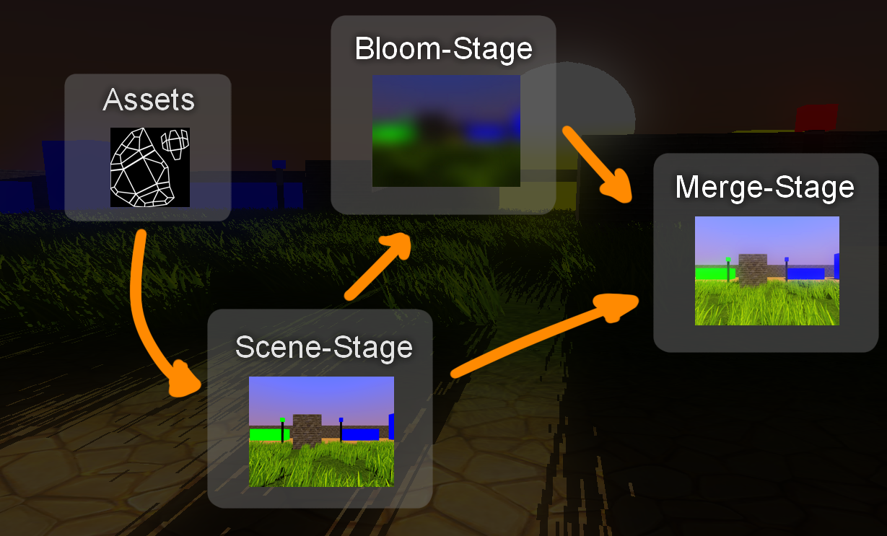

# Project
This project was for my CGA-lecture and was more like a playground to learn more about different graphical features in OpenGL.
So the goal of this project was to implement various amounts of different graphical features and make sure the features working together.
But my personal goal was to learn how to use OpenGL in C++.
The project has not been updated or polished since the project was completed.
Therefore is my current goal to bring it back to a more polished state which holds with my current standards and
implements the whole framework idea I had back then.

# Features

Here are all features I implemented in the project.\
I will explain these features a bit but if you want a more detailed version
use this [link](https://learnopengl.com/).

## Billboards

Billboards are textured planes which are always directed to the camera. They are also a efficient way to render objects like leaves, grass, flowers or particles. As you see on the image above, this is not a billboard. At first the grass was implemented as billboard but
it has a unnatural look so I implement it as two crossed planes which are moving to the wind.
The downside of this is if you getting too close to it at a specific angle of perspective you see that it is only a simple plain.
Since I used images with transparency I activated alpha-testing to display accurate transparency.

## Shadowmapping

Basic shadowmaps are for creating shades on objects with a light source.
Everything in sight of the light source is in light so we place a 2nd camera at the position of the light.
At first you render the depth map through the 2nd camera.
Then you render the scene through the normal camera and map the position of the depth map to
the perspective of the normal camera. As you now know what the light source is seeing you can
darken everything what it is not seeing.

## Skybox

Skyboxes are the background of a scene.
Basic skyboxes are boxes around the camera which uses textures called cubemaps for the sides in the cube.
OpenGL has already a implementation for cubemaps so you can load a whole cubemap as texture.
After you loaded your cubemap you give your shaders a 3D-vector which points in the direction your camera is orientated.
Now you can use the cubesampler to extract the texel from the cubemap.
Skybox-cubemaps are mostly a background scene from one point of view. So it's not directly possible
to combine simple 6 photos from the top, bottom, left, right, front and back of a scene.

## Bloom & Glow

Bloom & Glow shaders gives objects which illuminate light or shine brighter a smooth aura to them.
This effect on other pixels is called **bleeding**.
Since I used this shader in one of my other projects I also used a lumination-filter to brighten objects
which normally are not glowing.
To let objects shine brighter you render the scene which only glowing objects on a seperate texture.
Now you can use gaussian blur to let the objects bleed.
After that you merge the blurred texture with the current scene.

# Demonstration
You can download a compiled version from the releases [here](https://github.com/ShadeForge/CGAPlayground/releases).\
There are also standalones for single features. If you try out the main application read the section below for the controls.

## Controls

Move with the basic WASD-mapping and look around with your mouse.
If you want to stop or accelerate time use the key '1' to slow the time or the key '2' to accelerate the time.

# Framework Idea
The first feature I wanted to implement was an easy and fast way to create & play with new graphical features.
Therefore I implemented multiple wrapper and builder classes for different opengl-objects.
The basic idea was to develop a system which allows to create your own whole render-pass with xml.
With this said, in the current state it is **NOT** possible to create a render-pass with xml.
To actually implement this I had following image in my head:

So I wanted to develop shader-stages which input & output can be connected to other
shader-stages to create a whole render-pass. Now implement asset-loaders & various builders.
With that you should be able to define shaders with shader-stages and plug them together to create a whole render-pass
without the need of prior knowledge how specific opengl-code is written.

### But this already exist!
Yea, I know that it is already implemented in some way or the other by well-known engines or frameworks.
But it was my idea back then to play around and get better knowledge with architectures and opengl.

### What about the endless cycle?
I don't know why it should be a big problem to just check if it will end in such a cycle and
then let the developer know that his render-pass creates such cycle and will be closed because of that.

# Note of thanks
The most time I was reading through tutorials & forums for different approaches for 3d-programming-techniques.\
Even though I worked by myself most of the time, I still want to thank those who steered me on the right track.\
Thanks for everyone who helped me back then on my journey.\
You know who your are. ;)

# Links
Since these are more basics of 3d-programming here are some links of basic tutorials for OpenGL which was helpful to create this project.
- [LearnOpenGL](https://learnopengl.com/)
- [OpenGL-Tutorial](http://www.opengl-tutorial.org/)
