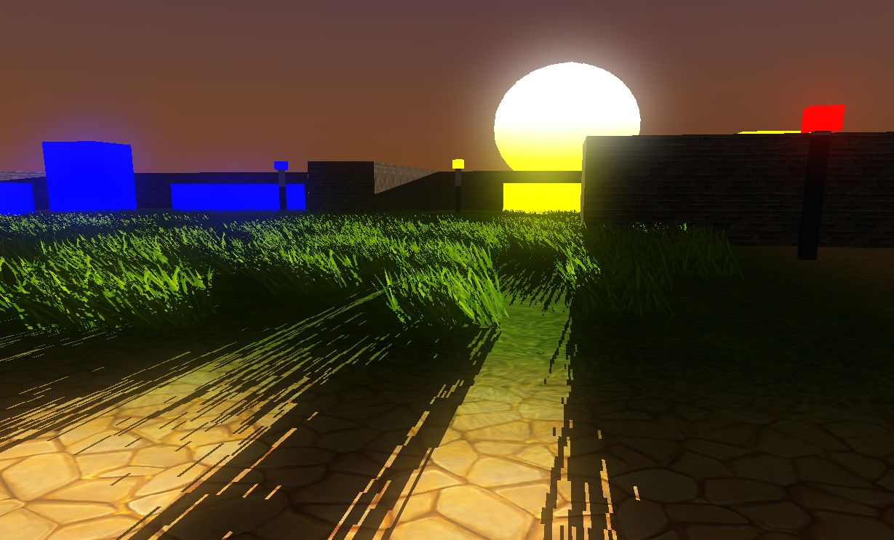
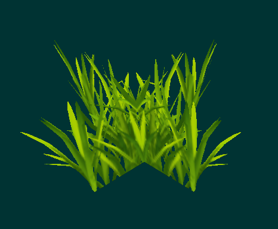
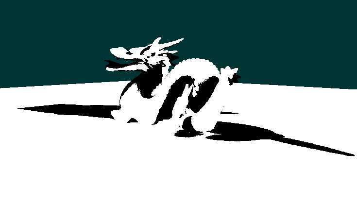
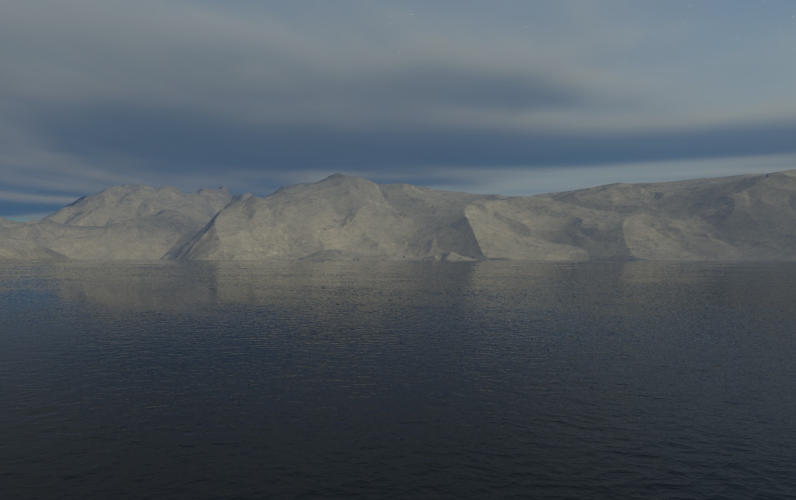
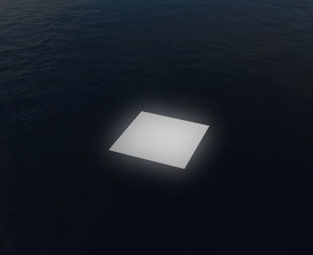
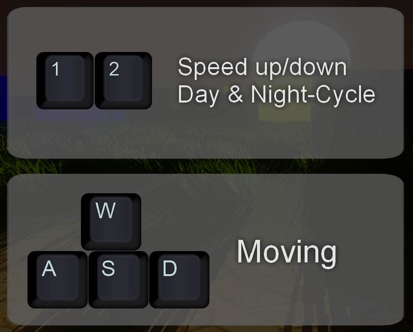

# Project
This project was for my CGA-lecture and was more like a playground to learn more about different graphical features in OpenGL.
My personal goal was to refresh my C++ skills and also learn how to use OpenGL in C++.
The project has not been updated or polished since the project was completed.
Therefore is my current goal to bring it back to a more polished state which holds with my current standards and
implements the whole framework idea I had back then.

# Features

Here are all features I implemented in the project.\
I will explain these features a bit but if you want a more detailed version
use this [link](https://learnopengl.com/).

## Billboards

I implement it with two planes and culling disabled, so that the grass texture was renderes on both sides of each plane.
Since there is not much more to it I implemented wind that let the grass move.

## Shadowmapping

Simple Shadowmapping is done with a 2nd camera as light source.
Everything in sight of the 2nd camera is in shadow.
At first you render the depth map through the light source like a camera.
Then you render the scene through the normal camera and map the position of the depth map to
the perspective of the normal camera. Now you know what the light source is seeing you can
darken everything what it not see.

## Skybox

Skyboxes can be implemented with cubemaps.
OpenGL has already a implementation for cubemaps so you can load a whole cubemap as texture.
After you loaded your cube map you give your shaders a 3D-vector which points in the direction your camera is orientated.
Now you can the cubesampler to extract the texel from the cubemap.
Skybox-cubemaps are mostly a background scene from one point of view. So it's not directly possible
to combine simple 6 photos from the top, bottom, left, right, front and back of a scene.

## Bloom & Glow

Bloom & Glow shaders gives objects which illuminate light or shine brighter a smooth aura to them.
This effect on other pixels is called **bleeding**.
Since I used this shader in one of my other projects I also used a luminationfilter to brighten objects
which normally not glowing.
To let objects shine brighter you render the scene which only glowing objects on a seperate texture.
Now you can use gaussian blur to let the objects glowing bleed.
After that you merge the blurred texture with the current scene.

# Demonstration
You can download a compiled version from the releases [here](https://github.com/ShadeForge/CGAPlayground/releases).\
There are also standalones for single features. If you try out the main application read the section below for the controls.

## Controls

Move with the basic WASD-mapping and look around with your mouse.
If you want to stop the time or accelerate time
use the key '1' to slow the time or the key '2' to accelerate the time.

# Framework Idea
If you are not interest in the idea I had back then, feel free to skip this.
The first feature I wanted to implement was an easy and fast way to create & play with new graphical features.
Therefore I implemented multiple wrapper and builder classes for different opengl-objects.
The basic idea was to develop a system which allows to create your own whole render-pass with xml.
With this said, in the current state it is **NOT** possible to create a render-pass with xml.
To actually implement this I had following image in my head:

// TODO: Image of Framework idea

So I wanted to develop shader-stages which input & output can be connected to other
shader-stages to create a whole render-pass. Now implement asset-loaders, 
With that you should be able to define shaders with shader-stages and plug them together to create a whole render-pass
without the need of prior knowledge how specific opengl-code is written.

### But this already exist!
Yea, I know that it is already implemented in some way in other engines or frameworks.
But it was my idea back then to play around and get better knowledge with architectures and opengl.

### What about the endless cycle?
I don't know why it should be a big problem to just check if it will end in such a cycle and
then let the developer know that his render-pass creates such cycle and will be closed because of that.

# Note of thanks
The most time I was on the internet and read anything about different approaches for 3d-programming.\
So was also often in the office of my professor to get some advice or support.\
Thanks for everyone who helped me back then on my journey.\
Also thanks to the person who gaves me the most feedback by reading through my whole documentation & code.\
You know who your are. ;)

# Links
Since these are more basics of 3d-programming here are some links for beginners who may step into this repository.
- [LearnOpenGL](https://learnopengl.com/)
- [OpenGL-Tutorial](http://www.opengl-tutorial.org/)
